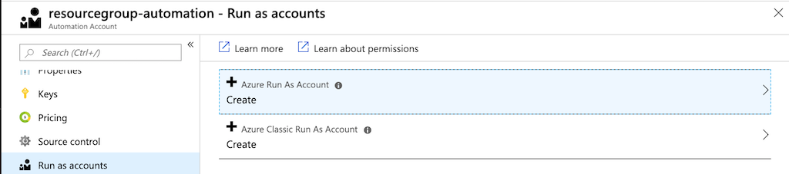
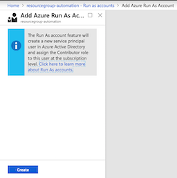
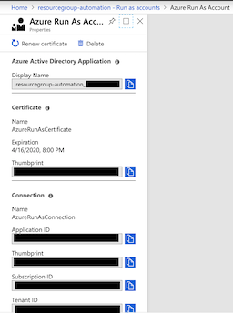

# Creation of Palo Alto IP Address Object Groups through Serverless Automation

## Introduction

While Palo Alto Network firewall PANOS 8.+ supports a connection to Azure that enables automatic creation of dynamic ip address groups, limititations in the way it reads an Azure resource's attributes render it unsuited Yale University's environment. This solution takes advantage of the rich automation features of Azure to implement an automation pipeline triggered by the creation, modification, or deletion of an Azure Virtual machine and resulting in a configuration file that may be consumed by a PAN firewall device.

## Description of Solution

## Implementation of Solution

### Creation of runbook
```powershell
Login-AzAccount -Subscription '{{ SUBSCRIPTION_NAME }}'

$AZURE_SUBSCRIPTION_ID = $(Get-AzContext).Subscription.Id
$AZURE_DEPLOYMENT = "resourcegroup-$(Get-Date -Format 'yyMMddHHmmm')-deployment"
$AZURE_DEPLOYMENT_LOCATION = '{{ DeploymentLocation }}'

md ./scratch/resourcegroup
# .gitignore file excludes contents of ./scratch
cp ./templates/resourcegroup/azuredeploy.parameters.json ./scratch/resourcegroup/.

# Edit ./scratch/resourcegroup/azuredeploy.parameters.json
# Replace placeholder parameter `{{ [valuename] }}` with appropriate values

# Create new resource group
$deployment = New-AzDeployment -Name $AZURE_DEPLOYMENT `
                               -Location $AZURE_DEPLOYMENT_LOCATION `
                               -TemplateFile ./templates/resourcegroup/azuredeploy.json `
                               -TemplateParameterFile ./scratch/resourcegroup/azuredeploy.parameters.json

$AZURE_RESOURCE_GROUP = $deployment.Outputs.resourceGroupName.Value
```

```powershell
# Create a new Azure Automation Account
$automationAccount = New-AzAutomationAccount -Name 'panostg-automation' `
                                             -ResourceGroupName $AZURE_RESOURCE_GROUP `
                                             -Location $AZURE_DEPLOYMENT_LOCATION `
                                             -Plan basic

$AZURE_AUTOMATION_ACCOUNT_NAME = $automationAccount.AutomationAccountName
```
Next, a new **Run as Account** will need to be created.

To continue, navigate to the Azure Portal page for the automation account **panostg-automation** and select **Run as accounts** under **Account Settings**. Click on **Azure Run as Account**.



Click **Create** on the following blade:



This will result in a new **Azure Automation Run As Account**:



A corresponding **AzureRunAsConnection** will be created also and can be viewed under the **Shared Resources** of the ***resourcegroups-automation** Azure Automation Account:


Once the account has been created, it must be assigned the proper role over the subscription. A Runas Automation account typically posseses `Contributor` over the scope of the subscription. Since this runbook will read information regarding the ip addresses, it will be given `Reader`, instead.

```powershell
# Get AppId of the automation account.
$AZURE_AUTOMATION_ACCOUNT_APPID = $(Get-AzADApplication -DisplayNameStartWith $('{0}_' -f $AZURE_AUTOMATION_ACCOUNT_NAME)).ApplicationId.Guid
```
### Creation of logic App

A service principal must be created for use by the Azure runbook and by the Logic App API connection object.

## Author

Vincent Balbarin <vincent.balbarin@yale.edu>

## License

The licenses of these documents are held by [@YaleUniversity](https://github.com/YaleUniversity) under [MIT License](/LICENSE.md).

## References
